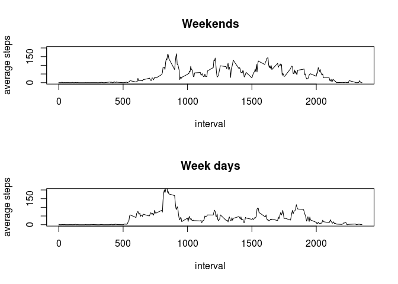

# Reproducible Research: Peer Assessment 1


## Loading and preprocessing the data

We do not include the file downloading code, as the data is alos included in the repo. 
We need to load the csv file, but I do the unziping at the same time. We need the header, and if you look at the file, you see that the separator is ",". So, the loading code is:


```r
steps_data <- read.csv(unz("activity.zip", "activity.csv"), header=T,  sep=",")
```

we also need to make sure that the date column is a real date variable:


```r
steps_data$date <- as.Date(as.character(steps_data[,2]))
```

## What is mean total number of steps taken per day?

The handiest function for that would be the "aggerage" functions:


```r
total_steps <- aggregate(steps ~ date, data=steps_data, sum , na.rm=TRUE )
mean_steps <- aggregate(steps ~ date, data=steps_data, mean , na.rm=TRUE )
head(total_steps)
```

```
##         date steps
## 1 2012-10-02   126
## 2 2012-10-03 11352
## 3 2012-10-04 12116
## 4 2012-10-05 13294
## 5 2012-10-06 15420
## 6 2012-10-07 11015
```

```r
head(mean_steps)
```

```
##         date    steps
## 1 2012-10-02  0.43750
## 2 2012-10-03 39.41667
## 3 2012-10-04 42.06944
## 4 2012-10-05 46.15972
## 5 2012-10-06 53.54167
## 6 2012-10-07 38.24653
```

Then we can make a histogram of the the total steps. I the simplest way is plotting a bar plot:


```r
barplot(total_steps$steps, names.arg = total_steps$date,  ylab="Total Steps", xlab="Date")
```

<!-- -->

and also the average value instagram:

```r
barplot(mean_steps$steps, names.arg = total_steps$date,  ylab="Average Steps", xlab="Date")
```

<!-- -->


we can also calculate the median: 

```r
median_steps <- aggregate(steps ~ date, data=steps_data, FUN=median , na.rm=TRUE )
```

Let's look at the summary:

```r
summary(median_steps)
```

```
##       date                steps  
##  Min.   :2012-10-02   Min.   :0  
##  1st Qu.:2012-10-16   1st Qu.:0  
##  Median :2012-10-29   Median :0  
##  Mean   :2012-10-30   Mean   :0  
##  3rd Qu.:2012-11-16   3rd Qu.:0  
##  Max.   :2012-11-29   Max.   :0
```

But the median value is zero for all days. Since this seems a little strange, I focus on one day, naturally the day with the maximum of total steps, November 23rd, and then we calculate the quantile:


```r
steps_11_23 <- steps_data[steps_data$date=="2012-11-23",]
quantile(steps_11_23$steps)
```

```
##     0%    25%    50%    75%   100% 
##   0.00   0.00   0.00  21.25 760.00
```

as you an see, the median is zero.

## What is the average daily activity pattern?

We need to aggregate data based on the interval:


```r
average_interval_steps <- aggregate(steps ~ interval, data=steps_data, mean , na.rm=TRUE )
head(average_interval_steps)
```

```
##   interval     steps
## 1        0 1.7169811
## 2        5 0.3396226
## 3       10 0.1320755
## 4       15 0.1509434
## 5       20 0.0754717
## 6       25 2.0943396
```

Then we need to plot it in the simplest way:

```r
plot(average_interval_steps$interval, average_interval_steps$steps, type = "l", xlab = "interval", ylab = "average steps")
```

<!-- -->


## Imputing missing values

The total number of missing values can be calculated using:


```r
nrow(steps_data[is.na(steps_data$steps),] )
```

```
## [1] 2304
```

My strategy is that in the missing days, the data should be somehow similar to the other recorded days. So, I anticipate that the average steps in the interval does not change. 

I can use  the "na.mean" function. This function takes a vector, andd fills the na values by the mean of the other values. First, we need to load the library:


```r
library(imputeTS)
```


I have to apply that to all days for each interval value:


```r
na_removed  <- by(steps_data, steps_data$interval, function(x)  na.mean(x) )
```

The result is a long list that is seprated by the interval values. We just need to collaps the list into a data frame. For this last part we need an extra package:


```r
library(data.table)
```

Then 

```r
na_removed_fixed <- rbindlist(na_removed, use.names = TRUE) 
```

To see how the data has changed we plot the newly generated data frame again. Firs, we need to aggregate again through the dates (Hint! we do not need na.rm anymore):


```r
average_na_removed  <- aggregate(steps ~ interval, data=na_removed_fixed, mean  )
head(average_na_removed)
```

```
##   interval     steps
## 1        0 1.7169811
## 2        5 0.3396226
## 3       10 0.1320755
## 4       15 0.1509434
## 5       20 0.0754717
## 6       25 2.0943396
```

It is pretty clear that the average has not changed. Just for checking:


```r
plot(average_na_removed$interval, average_na_removed$steps, type = "l", xlab = "interval", ylab = "average steps")
```

<!-- -->

Althoug the average per interval has not changed, the histrogram of the daly steps has chnaged:


```r
total_steps_na_removed  <- aggregate(steps ~ date, data=na_removed_fixed, sum  )
mean_steps_na_removed <- aggregate(steps ~ date, data=na_removed_fixed, mean  )
median_steps_na_removed <- aggregate(steps ~ date, data=na_removed_fixed, median )
head(total_steps_na_removed)
```

```
##         date    steps
## 1 2012-10-01 10766.19
## 2 2012-10-02   126.00
## 3 2012-10-03 11352.00
## 4 2012-10-04 12116.00
## 5 2012-10-05 13294.00
## 6 2012-10-06 15420.00
```

```r
head(mean_steps_na_removed)
```

```
##         date    steps
## 1 2012-10-01 37.38260
## 2 2012-10-02  0.43750
## 3 2012-10-03 39.41667
## 4 2012-10-04 42.06944
## 5 2012-10-05 46.15972
## 6 2012-10-06 53.54167
```

```r
head(median_steps_na_removed)
```

```
##         date    steps
## 1 2012-10-01 34.11321
## 2 2012-10-02  0.00000
## 3 2012-10-03  0.00000
## 4 2012-10-04  0.00000
## 5 2012-10-05  0.00000
## 6 2012-10-06  0.00000
```

The total steps per day after imputing the mean value for NAs:


```r
barplot(total_steps_na_removed$steps, names.arg = total_steps_na_removed$date,  ylab="Total Steps", xlab="Date")
```

<!-- -->

The average steps per day after imputing the mean value for NAs:


```r
barplot(mean_steps_na_removed$steps, names.arg = mean_steps_na_removed$date,  ylab="Total Steps", xlab="Date")
```

<!-- -->

The median of steps per day haas changed for only a few days. Pleas notice that this median was all zero before removing the NaS. 


```r
barplot(median_steps_na_removed$steps, names.arg = median_steps_na_removed$date,  ylab="Total Steps", xlab="Date")
```

<!-- -->


We calculated that the median of the raw data in all days is zero. But what about the median of the data when the na's are removed?


```r
median_na_removed_steps <- aggregate(steps ~ date, data=na_removed_fixed, FUN=median , na.rm=TRUE )
```

Just having a look on the summary of the median:

```r
summary(median_na_removed_steps)
```

```
##       date                steps       
##  Min.   :2012-10-01   Min.   : 0.000  
##  1st Qu.:2012-10-16   1st Qu.: 0.000  
##  Median :2012-10-31   Median : 0.000  
##  Mean   :2012-10-31   Mean   : 4.474  
##  3rd Qu.:2012-11-15   3rd Qu.: 0.000  
##  Max.   :2012-11-30   Max.   :34.113
```

Looking at the Summary, it is clear that the median has changed. 

In short, by removing Na's by adding the interval average, daily results are changed, median of the reuslts have changed, but the average per interval has not changed as we anticipated. 

## Are there differences in activity patterns between weekdays and weekends?

We need to mutate a new column by a conditional function. I use dplyr package. 


```r
library(dplyr)
```

```
## 
## Attaching package: 'dplyr'
```

```
## The following objects are masked from 'package:data.table':
## 
##     between, first, last
```

```
## The following objects are masked from 'package:stats':
## 
##     filter, lag
```

```
## The following objects are masked from 'package:base':
## 
##     intersect, setdiff, setequal, union
```

```r
na_removed_fixed_wn <-  mutate(na_removed_fixed, weekEnd=ifelse(weekdays(na_removed_fixed$date) %in% c("Saturday", "Sunday"), "WEEKEND", "WEEKDAY") )
```


Now averaging over all week days and weekends


```r
mean_weekend <- aggregate(steps ~ interval, data=na_removed_fixed_wn[na_removed_fixed_wn$weekEnd=="WEEKEND", ] , mean)
mean_weekday <- aggregate(steps ~ interval, data=na_removed_fixed_wn[na_removed_fixed_wn$weekEnd=="WEEKDAY", ] , mean)
```

Finally plotting:
IT has not been mentioned that the plots should be together. However, we need to fix the "y" range the same for both plotsz


```r
par(mfrow=c(2,1))
plot(mean_weekend$interval, mean_weekend$steps, type = "l", xlab = "interval", ylab = "average steps", main = "Weekends", ylim = c(0,200))
plot(mean_weekday$interval, mean_weekday$steps, type = "l", xlab = "interval", ylab = "average steps",main = "Week days", ylim = c(0,200))
```

<!-- -->
